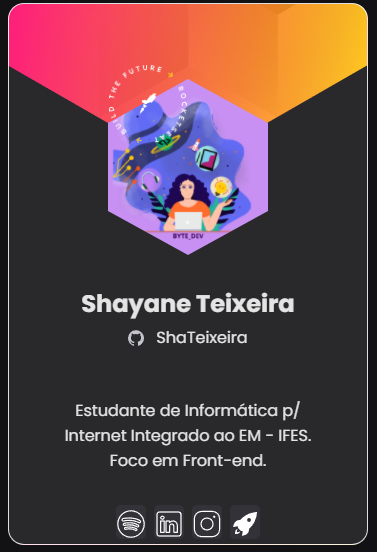

<h1 align="left">Olá pessoal . Eu sou Shayane.</h1>
</h1>

 

|  Idiomas    |
|-----------|
|[Inglês](README.md)| 
|[Português](readme_ptBR.md)| 

 

📬 Contato

 
  :computer: Em desenvolvimento, começando na área de programação. eu tenho 19 anos.  Formada em Tecnico em Informática p/ Internet Integrada ao Ensino Médio pelo Instituto Federal do Espírito Santo - IFES CAMPUS SERRA. O curso desejado no ensino superior é Bacharelado em Sistemas de Informação. Meu desejo é trabalhar  com front-end. Junto com meus estudos em Javascript quero iniciar também os estudos em UX/UI.

 
 
<!-- About -->

## Sobre Mim 
  👩‍🎓 Projeto Integrador finalizado com sucesso.
   
  🎓 Habilidades mais avançadas sobre  *JavaScript.* Pausa dos estudos em React.js
   
  🔆 Segue meu [Instagram](https://www.instagram.com/byte__dev/) de tech. 
   
  💻 Visite meus projetos [aqui](https://github.com/ShaTeixeira?tab=repositories)
   
  🔷 Iniciando estudos *C#.*
   
  💥 Gosto de tocar violão, ukulele. assistir series
  
  

## 🛠 Ferramentas
&nbsp;
&nbsp;
&nbsp;

  

## 🛠 Gerenciador de Dependências
&nbsp;
&nbsp;

  

## 🛠 Estudando
&nbsp;
&nbsp;
&nbsp;

  

## 🛠 Tecnologias

&nbsp;
&nbsp;
&nbsp;
&nbsp;
&nbsp;
&nbsp;

---

## 📈 GitHub Status:

 

